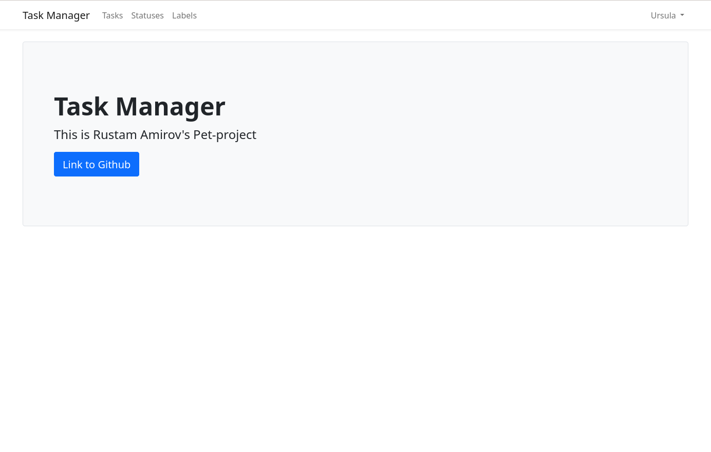
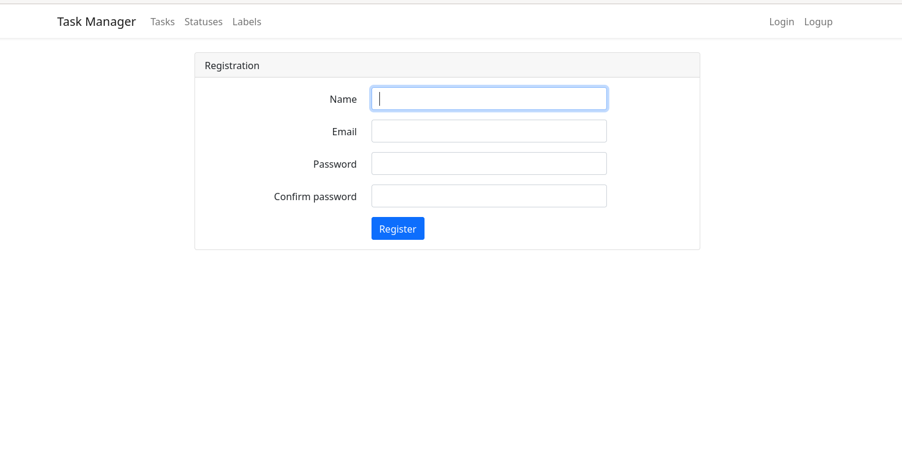
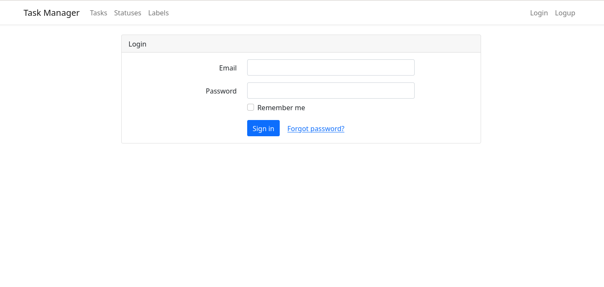
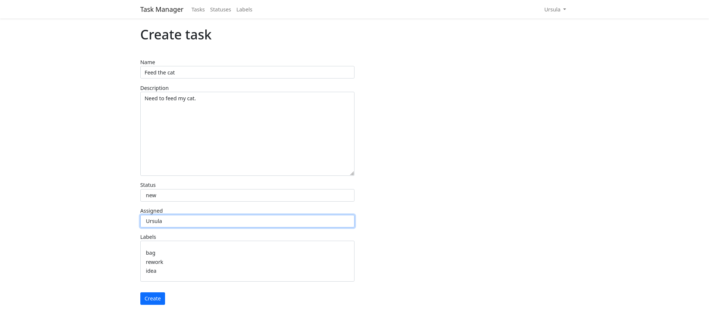
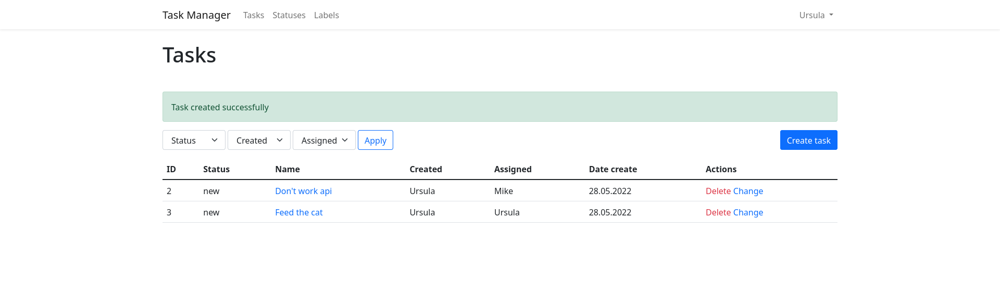
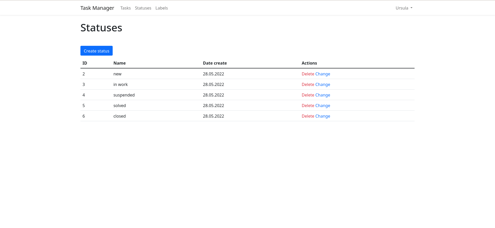

# CRM Task Manager
#### laravel pet-project
[](https://github.com/Rustam-Amirov/php-project-lvl4/actions)
[](https://github.com/github/docs/actions)
[](https://codeclimate.com/github/Rustam-Amirov/php-project-lvl4/maintainability)
[](https://codeclimate.com/github/Rustam-Amirov/php-project-lvl4/test_coverage)

[](image.png)

## For instualaion:
```
 git clone https://github.com/Rustam-Amirov/php-project-lvl4
 cd php-project-lvl4
 make install
 make setup
 make migrate
 make start
 ```
# It is a task manager with authorization and authentication

[](image.png)
[](image.png)

### There is support for Russian and English


## Task creation form:
[](image.png)
[](image.png)

## List statuses:
[](image.png)
